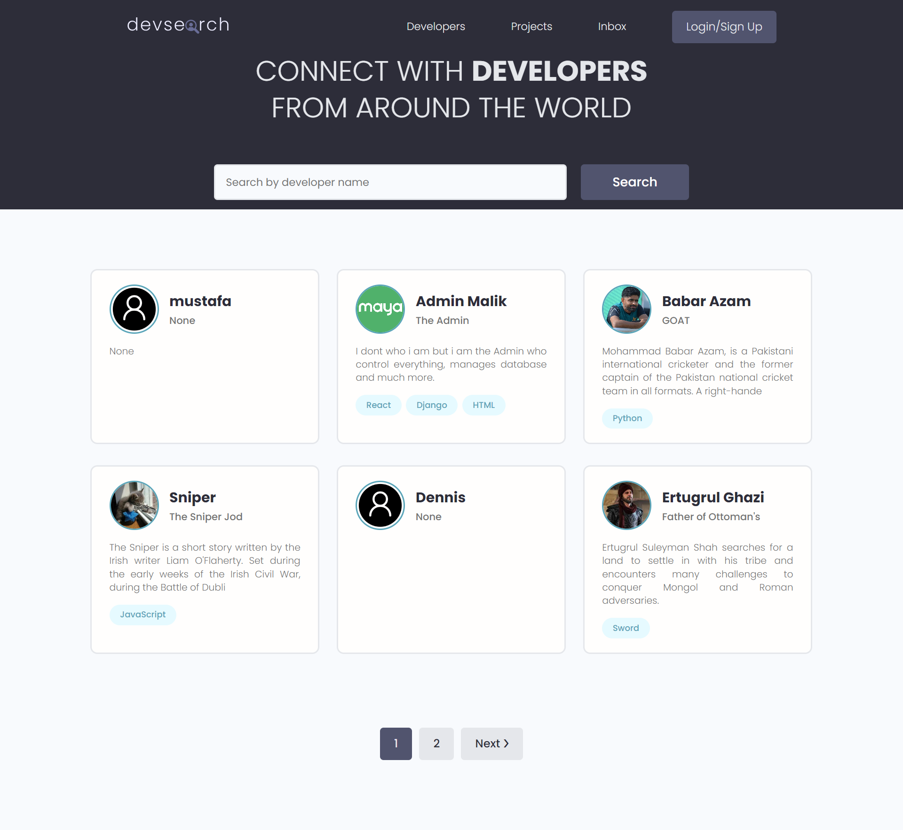
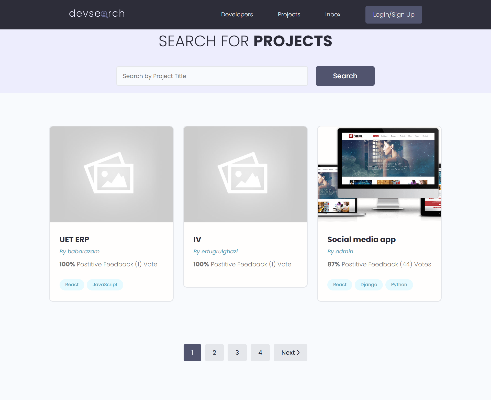
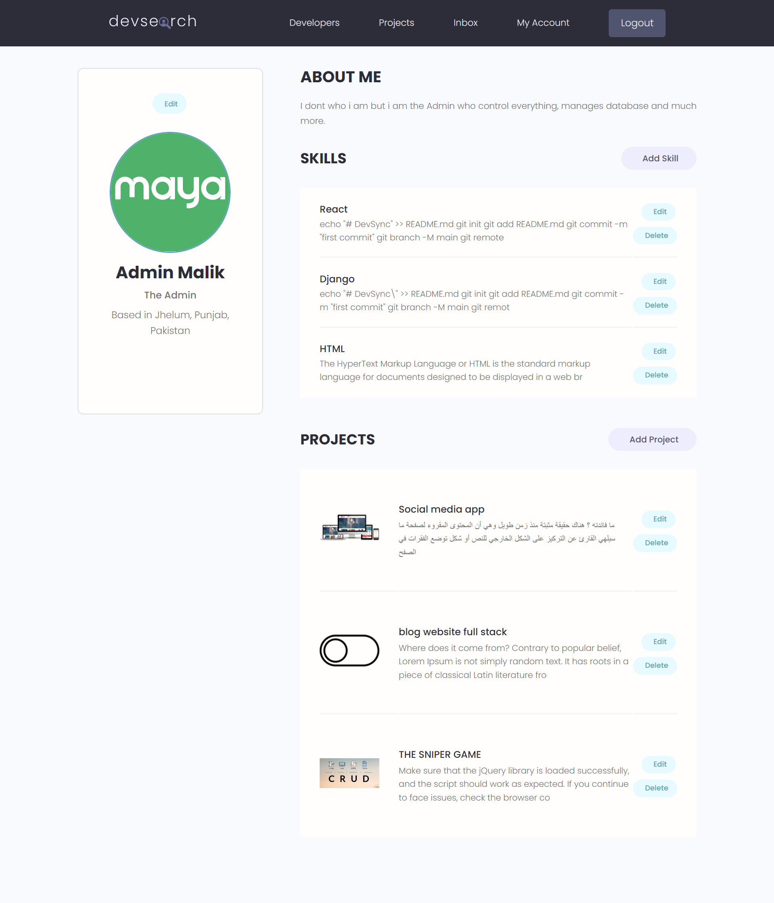
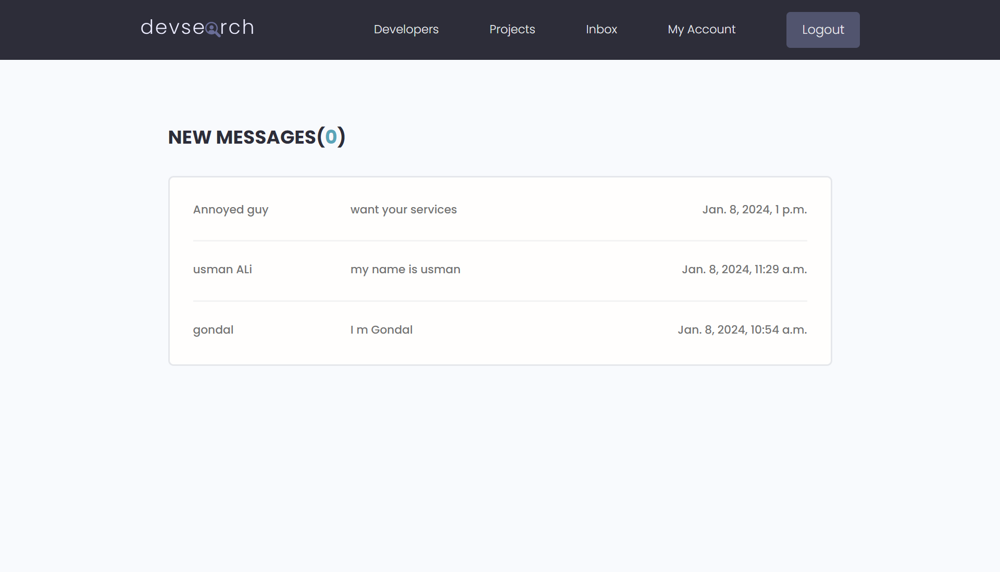
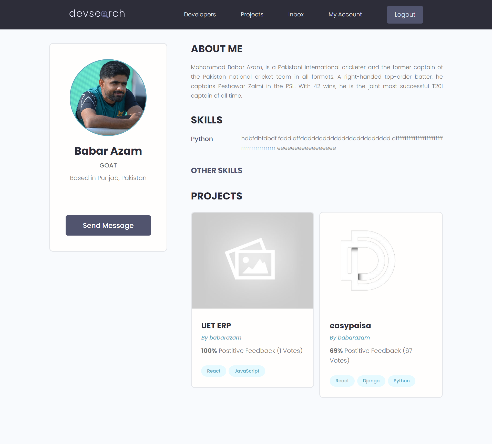
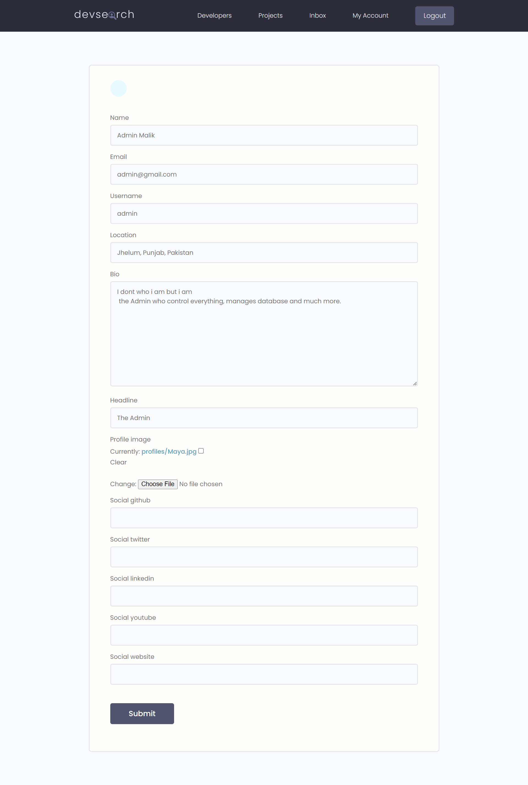

# DEV SYNC

[Visit the live site on Vercel](https://devsync-for-devs.vercel.app/)

DEV SYNC is a Django full-stack web application that enables developers to showcase their profiles and projects, acting as a portfolio. Users can create accounts, add their projects, and receive messages from viewers interested in their work.

## Project Overview

- **Basic Django Overview**
- **Database Design and Models**
- **Static Files Management**
- **User Registration & Authentication**
- **Search & Filters**
- **Pagination**
- **Building an API with Django REST Framework (DRF)**
- **Gmail Service for Email Notifications**
- **Cloudinary for Image Hosting**
- **Deployment on Vercel & Railway**

## Features

- **User Authentication:** Developers can create accounts, log in, and manage their profiles, including secure password reset functionality via email.
- **Profile Showcase:** Users can create and customize their developer profiles, showcasing their skills, bio, and social links.
- **Skills Management:** CRUD (Create, Read, Update, Delete) operations for managing developer skills.
- **Project Gallery:** Developers can add projects to their portfolio, providing details such as project name, description, technologies used, and a link to the project repository. Full CRUD functionality is available for project management.
- **Messaging System:** Users can receive messages from viewers interested in their projects or profiles, with the ability to manage and respond to messages.
- **Email Notifications:** A welcome email is sent to new users upon registration, and a password reset email is sent when users request it.
- **Search and Filters:** The platform provides search and filter options to make it easy for viewers to discover specific developers or projects.
- **Cloudinary Integration:** Images are hosted on Cloudinary, ensuring fast and reliable image delivery.
- **Deployment:** The application is hosted on Vercel, with the database hosted on Railway, providing a seamless production environment.

## Tech Stack

- **Backend:** Django, Django REST Framework
- **Frontend:** HTML, CSS, JavaScript
- **Database:** SQLite (for development), PostgreSQL (for production)
- **Authentication:** Django's built-in authentication system & Custom Authentication System
- **Email Service:** Gmail API
- **Image Hosting:** Cloudinary
- **Deployment:** Vercel (App Hosting), Railway (Database Hosting)

## Prerequisites

- Python 3+ installed
- Pip package manager
- PostgreSQL installed (for production deployment)

## Installation

1. Clone the repository:

    ```bash
    git clone https://github.com/hamzamalik22/DevSync.git
    cd dev-sync
    ```

2. Install the required packages:

    ```bash
    pip install -r requirements.txt
    ```

3. Set up the database:

    ```bash
    python manage.py migrate
    ```

4. Create a superuser:

    ```bash
    python manage.py createsuperuser
    ```

5. Run the development server:

    ```bash
    python manage.py runserver
    ```

## Preview

### Home Page



### Projects Page



### Account Page



### User Inbox



### User Profile



### Forms



## Contribution

Feel free to fork this repository and submit pull requests for new features or improvements. Contributions are always welcome!

## License

This project is licensed under the MIT License.

---

Thank you for checking out DEV SYNC! If you have any questions or feedback, feel free to reach out.
